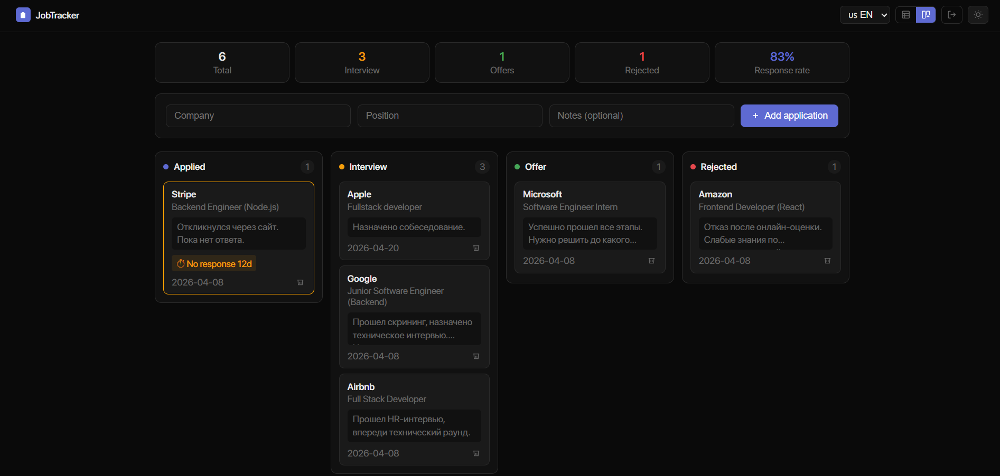
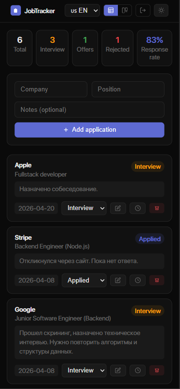
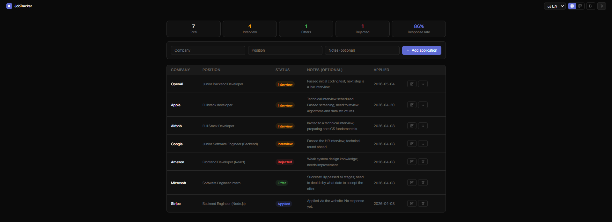

# Job Tracker


A job application tracker that behaves like a lightweight ATS.

Instead of just storing applications, it helps you understand your hiring pipeline, track progress, and take action when things stall.

🔗 **[Live Demo](https://job-tracker-xi-lake.vercel.app)**

---

## Why this exists

Most job trackers are simple lists.
They do not show what is actually happening with your applications.

This project focuses on **process visibility and decision-making**:

- Visual pipeline instead of a static list
- Activity history for every application
- Detection of stalled applications
- Basic analytics to understand outcomes

---

## Core Features

### Pipeline (Kanban View)

Visualize your applications across stages and move them with drag & drop.

### Activity Tracking

Every change is recorded: status updates, edits, and timeline per application.

### Stale Detection

Applications with no response for 7+ days are highlighted, helping you decide when to follow up or move on.

### Insights

Quick overview of total applications, interviews, offers, rejections, and response rate.

### Dual View

- **Table** → precise control, filtering, editing
- **Board** → process visualization

---

## Screenshots

### Kanban



### Mobile



### Table



### History


---

## Real Usage

I use this app to track my own job search:

- monitor response rate
- detect stalled applications
- track interview progress

---

## Tech Stack

| Layer        | Technologies                                                         |
| ------------ | -------------------------------------------------------------------- |
| Frontend     | React, TypeScript, Vite, React Router, react-i18next, react-toastify |
| Backend      | Node.js, Express, TypeScript, PostgreSQL                             |
| Auth         | JWT, bcrypt                                                          |
| Architecture | Controllers / Services / Repositories                                |
| Deploy       | Vercel (frontend) · Railway (backend + database)                     |

---

## Project Structure

```text
job-tracker/
├── client/
│   └── src/
│       ├── api/
│       ├── components/
│       ├── hooks/
│       ├── context/
│       ├── i18n/
│       └── pages/
└── src/
    ├── config/
    ├── controllers/
    ├── services/
    ├── repositories/
    └── middleware/
```

---

## Getting Started

### Quick copy-paste setup

```bash
# 1) Backend
cd job-tracker
npm install
npm run migrate
npm run dev

# 2) Frontend (new terminal)
cd client
npm install
npm run dev
```

### Backend

```bash
cd job-tracker
npm install
npm run migrate
npm run dev
```

### Frontend

```bash
cd client
npm install
npm run dev
```

### Environment Variables

```env
PORT=3000
JWT_SECRET=your_secret
DATABASE_URL=your_postgresql_url
FRONTEND_URL=http://localhost:5173
```

---

## Auth Session Model

- Access token: short-lived JWT (Bearer token in `Authorization` header)
- Refresh token: stored in `HttpOnly` cookie (`/auth` scope), rotated on refresh
- CSRF protection: `x-csrf-token` header must match `csrf_token` cookie for refresh/logout endpoints
- Endpoints:
  - `POST /auth/login`
  - `POST /auth/refresh`
  - `POST /auth/logout`
  - `POST /auth/logout-all`

## Health & Readiness

- `GET /health` — basic process health check
- `GET /ready` — readiness check with database ping (`SELECT 1`)

## Migrations

- SQL migrations are stored in `./migrations`
- Applied migrations are tracked in the `schema_migrations` table
- Run manually with:

```bash
npm run migrate
npm run cleanup:tokens
```

---

## Notes

- Built with focus on product thinking, not just CRUD
- Designed to simulate a simplified ATS workflow

---

[Читать на русском](README.ru.md)
